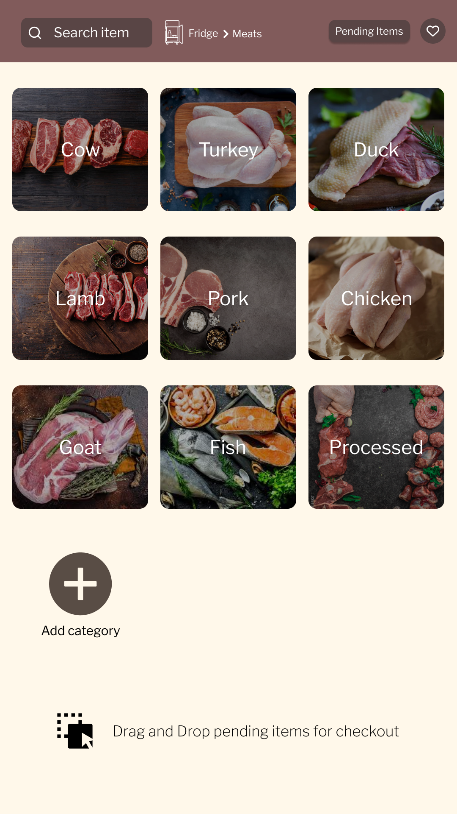

# Shopping List Application


Innovative kitchen management app with smart interfaces for efficient inventory control and enhanced productivity


## Description

Our innovative kitchen management application, developed using Angular CLI and Node.js, revolutionizes household organization with intuitive interfaces for efficient inventory control and heightened productivity. Tested and refined during the HY469 course, this mobile application seamlessly integrates with various smart devices within a smart home environment located in ITE FORTH, including fridge panels, bathroom panels, and table panels.

## Overview

Our application empowers users to effortlessly organize their shopping experiences by providing comprehensive insights into their household needs. It intelligently identifies products that require replenishment across different areas of the house, such as the kitchen and bathroom, while offering a curated smart list featuring real-time price updates from local vendors. Users can conveniently track purchased items and allocate them to designated spaces, such as the fridge, enhancing overall household efficiency. Moreover, the application offers an extensive library of recipes tailored to the ingredients available in the kitchen, inspiring culinary creativity and minimizing food waste. Additionally, users can stay informed about exclusive offers and monitor the status of household products, ensuring timely restocking and optimal utilization.

## Key Features
* Smart List Creation: Generate a personalized shopping list that calculates product prices and tracks their status, including purchase and storage location.

* Inventory Management: Receive notifications when essential household items are running low or require replenishment, ensuring seamless supply management.

* Recipe Database: Explore a diverse range of delicious recipes based on available kitchen ingredients, fostering culinary exploration and meal planning.

* Product Insights: Stay updated on special offers and monitor the status of household products, empowering informed purchasing decisions and efficient utilization.

## Screenshots


**Mobile**


|  |  |  |
|:---:|:---:|:---:|
| Smart List | Add Item | Favorite Items | 

|  |  |  
|:---:|:---:|:---:|
| Inside Home | Meat Section | Chicken Products | 

|  |  
|:---:|:---:|
| Recipe Navigation | Recipe Details | 


**Fridge Panel**


|  |  |  |
|:---:|:---:|:---:|
| Kitchen Fridge Section | Meat Section | Chicken Products | 

|  |  
|:---:|:---:|
| Liked Items | Pending Items for fridge | 


## Installation

What you will need:
* NodeJS
* Angular
* MongoDB

Tested on: 
* NodeJS v18.12.1
* Angular v14.2.8
* MongoDB v4.4

### Useful commands
Before running the application and after every new node_module is installed using `npm install @package-name`, all project members must execute in both *`backend`* and *`frontend`*:
```sh
npm install
``` 

For frontend, inside *`frontend`* folder:

> Run frontend:
```sh
ng serve
```

> Run frontend (open access from other devices using server's IP):
```sh
ng serve --host 0.0.0.0
```

For backend, inside *`backend`* folder:
> Run backend:
```sh
npm run dev
```

Run ng serve for a dev server. Navigate to http://localhost:4200/. The application will automatically reload if you change any of the source files.


**Do not forget**: mongod.exe (if on Windows) must be running for the Database to be used. 
